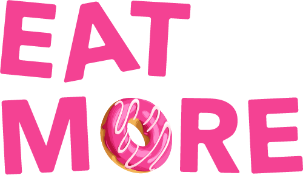

# 

[Eat More](https://eatmore.io) is a Telegram bot that reminds you to eat more.

I am open sourcing the code to give you an idea of what it takes to build such
a bot and hopefully inspire you to create your own.

### Installation

I wrote these steps from memory. It's likely that I missed something. If you run
into any problems please [message me on Telegram](https://t.me/marckohlbrugge)
and very clearly explain what's not working. What you tried. What you expected
to happen. What did happen. Try this:

1. `git clone https://github.com/marckohlbrugge/eatmore.git`

2. Create a Telegram bot using [@BotFather](https://t.me/botfather)

3. Copy sample.env to .env and fill out each variable

4. `bundle install`

5. Configure your database in `config/database.yml`

6. Create the database `rails db:create`

7. On production `rails telegram:bot:set_webhook` to configure the webhook to
   communicate with Telegram. Or in development `rails telegram:bot:poller` to
configure the poller.

### Don't want to use S3?

I use Heroku for hosting which doesn't support file uploads so I'm using S3
instead. If you want to simplify your setup you can configure
[Shrine](https://shrinerb.com) to use your local file system instead. You can do
this in [`config/initializers/shrine.rb`](config/initializers/shrine.rb).

### Want to join a community of makers?

Eat More was [built in public](https://wip.chat/products/970) in 1 day on WIP.
We are a community of makers motivating each other to ship. [Join us](https://wip.chat).

### Questions, feature requests, bugs, etc

Please [open an issue](https://github.com/marckohlbrugge/eatmore/issues/new) if
you find a bug. Pull requests with bug fixes or improvements are welcome.

The code is provided as is. Support inquiries and feature requests are likely to
be ignored. Please don't create issues for these.

### LICENSE

The code is licensed under [MIT license](LICENSE). Images are NOT included. You cannot use
the donuts illustration without getting a license from the creator. I'm not
linking it here however, because I don't want everyone to start using the same
image. You can also not use the Eat More logo.
